---
title:
aliases:
tags:
---

# Fantareal 新手说明书

> [!info]
> 这是一份写给新手的说明书。
>
> 不聊代码，主要想把几件事讲明白：
> - 预设是什么
> - 角色卡是什么
> - 记忆是什么
> - 世界书是什么
> - 它们之间到底是什么关系
> - 一条信息该塞到哪
> - 这些新增的世界书功能该怎么理解、怎么用
> - 出问题时该去哪里看、怎么排

> [!abstract]
> 建议你这样读：
> 1. 先看第 1～3 章，把整体关系理顺
> 2. 再看第 4～9 章，搞懂世界书和新增功能
> 3. 最后看第 10～16 章，学实际操作、排错和长期维护

## 术语统一约定

为了后面不绕晕，先把几个常用说法统一一下：

- **预设**：指控制输出风格与说话方式的规则集合
- **角色卡**：指角色本人的长期核心设定
- **记忆**：指聊天过程中沉淀下来的已发生事实
- **世界书**：指按规则参与的补充设定，既可以是关键词触发，也可以是常驻
- **关键词触发**：指提到某个关键词时才进入的世界书
- **常驻**：指不依赖关键词、每轮都长期参与的世界书
- **位置**：指世界书进入提示词时所在的大层级
- **深度**：指聊天内注入离当前回复有多近
- **注入顺序**：指同一层里的先后顺序
- **递归**：指一条世界书条目继续带出另一条世界书条目

> [!tip]
> 本文里如果出现：
> - **Worldbook Hits**，统一理解为“世界书命中列表”
> - **Worldbook Debug**，统一理解为“世界书调试信息”
> - **Prompt Preview**，统一理解为“提示词预览”

## 全文导航

> [!tip]
> 这里是目录-manbo。
>
> 第 0 章：这份说明书适合谁
> 第 1 章：四大模块先看懂
> 第 2 章：最容易搞混的地方
> 第 3 章：一条信息到底该放哪
> 第 4 章：世界书基础入门
> 第 5 章：位置系统——为什么这些新增的世界书功能更强
> 第 6 章：聊天深度怎么理解
> 第 7 章：顺序怎么控制
> 第 8 章：递归 V1 怎么理解
> 第 9 章：世界书设置页怎么用
> 第 10 章：世界书词条页怎么用
> 第 11 章：导入与导出怎么理解
> 第 12 章：批量编辑怎么用
> 第 13 章：调试怎么看
> 第 14 章：实战案例
> 第 15 章：常见误区
> 第 16 章：推荐工作流
> 附录 A～D：术语表、快速判断表、推荐默认值

---

# 第 0 章：这份说明书适合谁

> [!tip]
> 如果你已经会导入角色卡，但经常分不清“预设、角色卡、记忆、世界书”该怎么用，这份说明书就是写给你的。

这份说明书比较适合下面这些人：

- 第一次接触 Fantareal 的新手
- 会聊天，但不会整理设定的人
- 会导入角色卡和预设，但不知道世界书怎么配的人
- 想知道“为什么改了预设，角色却没变”的人
- 想知道“为什么世界书不是一直生效”的人

这份说明书**不要求你会写代码**。
你只要先记住一件事：这个项目里，不同模块各管各的，不是一锅炖。

## 你看完后应该能做到什么

看完以后，你大概能知道这些事：

1. 分清预设、角色卡、记忆、世界书分别是做什么的
2. 知道一条信息该放在哪个模块里
3. 看懂世界书的基本工作方式
4. 明白为什么“关键词触发的补充设定”要写进世界书
5. 明白为什么“长期不变的人设”要写进角色卡
6. 知道以后继续学位置系统、深度、递归时，该怎么理解

---

# 第 1 章：四大模块先看懂

这一章不用急着抠细节。先把四个东西分开，后面就会顺很多。

## 1.1 先记住这四句就够了

> [!tip]
> 这里先别急着记术语，先把这四句记住。

- **预设**：管“怎么说”
- **角色卡**：管“谁在说”
- **记忆**：管“以前发生过什么”
- **世界书**：管“这轮还要补什么设定”

你先把这四句抓住，后面很多地方自然就不乱了。

---

## 1.2 预设是什么

预设决定的是：

> **模型用什么方式说话。**

你可以把它理解成“说话规则”，也可以理解成“输出风格总开关”。

### 预设常见内容
比如：

- 不要抢写用户动作
- 尽量长段落
- 使用第二人称
- 减少重复表达
- 不要太快收尾
- 不要替用户做决定

这些都不是角色“是谁”的问题，
而是角色“怎么表达”的问题。

### 还是拿个例子来说

假设角色是雪音。

角色卡决定：
- 雪音是清冷慢热的店主

预设决定：
- 雪音回答时不要抢写你的动作
- 段落尽量长一些
- 用第二人称和你说话

你会发现，其实就是这么回事：

- **角色卡没有变**
- **雪音还是雪音**
- 但她说话的节奏、形式、风格变了

这就是预设主要在干的事。

### 一句话理解
> 预设不是改设定，预设是改输出方式。

---

## 1.3 角色卡是什么

角色卡决定的是：

> **模型扮演的是谁。**

它是一个角色的长期核心设定。

### 角色卡通常会放什么
比如：

- 角色名字
- 性格
- 身份
- 背景
- 关系倾向
- 开场白
- 示例对话

### 还是拿个例子来说

还是拿雪音举例。

角色卡里可以写：

- 雪音是听雨咖啡的经营者
- 她清冷、慢热，不轻易把心事讲出来
- 她对熟人和陌生人的态度不一样
- 她平时说话偏克制

这些内容决定的是：

> **雪音这个人到底是谁。**

### 一句话理解
> 角色卡不是那种“这轮临时补一嘴”的东西，它更像“角色本人长期不太会变的核心设定”。

---

## 1.4 记忆是什么

记忆决定的是：

> **你们以前发生过什么。**

它记录的是聊天过程中慢慢沉淀下来的事实。

### 记忆通常会放什么
比如：

- 你已经来过听雨咖啡五次
- 你和雪音已经从陌生走到熟悉
- 你们昨天讨论过伦敦
- 你上次离开前留下了某句话
- 她已经知道你不喜欢太热闹的地方

这些内容不是“雪音天生如此”，
而是“你们相处后形成的事实”。

### 还是拿个例子来说

角色卡里不会写：

- 你昨天已经和雪音和好了

因为这不是雪音的长期核心设定。
这更像是聊天过程中已经发生的事，应该进入记忆。

### 一句话理解
> 记忆不是规则，记忆更像“已经发生过、而且之后还该记得的事实”。

---

## 1.5 世界书是什么

世界书决定的是：

> **这轮要不要额外补进来一段设定。**

它最常见的用法当然是：

- **关键词触发**：提到某个词时再补进来

但它也可以有另一种模式：

- **常驻**：不依赖关键词，每轮都参与

所以更准确地说：

> 世界书可以理解成一套“按规则加进来的补充资料”。

### 世界书适合放什么
比如：

- 地点设定
- 道具设定
- 组织设定
- 世界观背景
- 某个角色的隐藏补充
- 某个话题被提到时的额外说明
- 极少数需要长期存在、但又不是输出风格本身的补充规则

### 还是拿个例子来说 1：关键词触发
你输入：

> 我推门走进听雨咖啡。

这时如果世界书里有一条词条：

- 标题：听雨咖啡
- 关键词：听雨咖啡
- 内容：这是一家位于老居民楼底层的安静咖啡馆……

那模型这一轮就会临时拿到这段补充设定。

换句话说：

- 你没提到“听雨咖啡”时，这条未必会出现
- 你提到了，它才会被补进来

### 还是拿个例子来说 2：常驻
如果有一条世界书是：

- 标题：长期叙事基调
- 触发类型：常驻
- 内容：当前故事以慢节奏、长期陪伴、关系积累为主，不以激烈主线推进为核心。

那它就不需要等你提到某个关键词，
而是会长期参与。

### 一句话理解
> 世界书既可以是“按关键词触发的补充资料”，也可以是“极少数长期参与的常驻补充资料”。

---

## 1.6 先看一眼，这四块是怎么一起起作用的

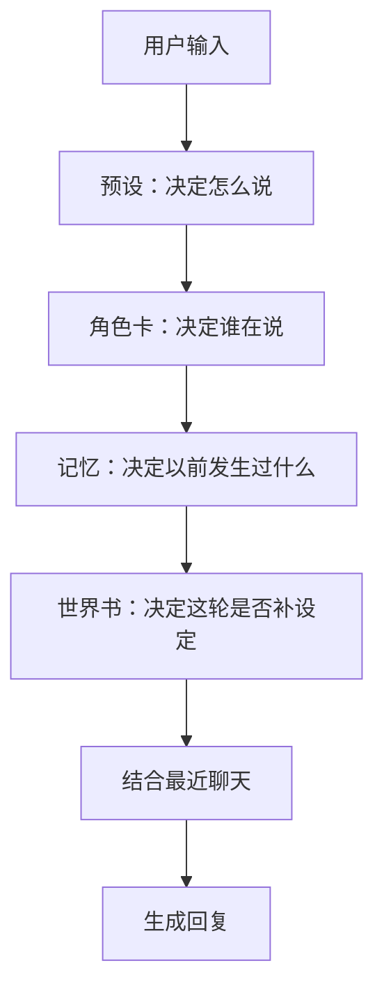

> [!important]
> 这四个模块不是互相顶替的关系，更像是一层一层往上叠。

---

## 1.7 还是拿同一个例子，再顺一遍

### 预设
- 不抢写用户动作
- 长段落
- 第二人称

### 角色卡
- 雪音是谁
- 她的性格和身份

### 记忆
- 你已经来过几次店里
- 你们关系比第一次更近

### 世界书
- 提到“听雨咖啡”时，补地点设定
- 提到“伦敦”时，补相关背景
- 提到某个道具时，补相关说明

### 最后的核心区别
- **预设**：决定表达方式
- **角色卡**：决定角色本体
- **记忆**：决定关系和过去
- **世界书**：决定临时补充什么

---

# 第 2 章：最容易搞混的地方

> [!warning]
> 新手最常见的问题，通常不是“不会点按钮”，而是“脑子里有东西，但不知道该塞到哪”。

这一章就专门把这个事讲明白。

---

## 2.1 为什么改了预设，角色却没变

因为预设改的是：

> **怎么说**

而不是：

> **谁在说**

### 例子
你把预设改成：

- 长段落
- 不抢写
- 第二人称

那雪音还是雪音。
她的身份、性格、背景并不会自动变。

改变的是：
- 她输出的节奏
- 她的段落长度
- 她会不会替你写动作

### 所以说白了
> 改预设，不等于改角色。

---

## 2.2 为什么改了世界书，角色卡却没跟着变

因为世界书更偏向：

> **按场景触发的临时补充**

而角色卡是：

> **角色本人的长期核心设定**

### 例子
角色卡写：

- 雪音是清冷慢热的店主

世界书写：

- 提到“伦敦”时，补她对伦敦的复杂情绪

这里的关系是：

- 角色卡告诉你雪音是谁
- 世界书告诉你“当伦敦这个话题出现时，还有一层补充背景”

### 所以说白了
> 世界书不是用来替代角色卡的，而是用来补角色卡的。

---

## 2.3 为什么记忆不等于世界书

这两个最容易被混淆。

### 记忆
是：

> 已经发生过的事实

### 世界书
是：

> 某个关键词出现时，临时补充的设定

### 例子
#### 适合放进记忆
- 你昨天已经和雪音和好了
- 你已经来过店里五次
- 她知道你喜欢靠窗的位置

#### 适合放进世界书
- 提到“听雨咖啡”时补店面设定
- 提到“伦敦”时补她的相关背景
- 提到“铁盒”时补道具说明

### 一句话区别
> 记忆管“已经发生过什么”，世界书管“碰到某个词要补什么”。

---

## 2.4 为什么角色卡也不等于世界规则

角色卡是“一个人”。
世界规则是“这个世界怎么运作”。

### 例子
#### 角色卡里适合写
- 雪音性格清冷
- 雪音是店主
- 她对熟人会慢慢放松

#### 世界书里更适合写
- 听雨咖啡的环境和日常氛围
- 这个地点适合长期陪伴式聊天
- 某个关键词出现时要补一段背景说明

### 所以说白了
> 角色卡管角色本人，世界书更适合管地点、背景、规则和关键词补充。

---

## 2.5 这里最容易踩的三个坑

### 错误 1：把长期人设写进世界书
比如：

- 雪音一直都很慢热

这更适合写进角色卡，
因为这是长期稳定的人设核心。

### 错误 2：把过去发生的事写进角色卡
比如：

- 你昨天已经和她和好了

这更适合写进记忆，
因为这是聊天过程中发生的事实。

### 错误 3：把输出规则写进角色卡
比如：

- 不要抢写用户动作
- 尽量长段落

这些更适合放进预设。

---

## 2.6 用一张图把这个关系看清楚

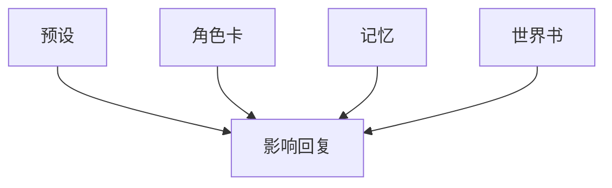

### 这张图要表达的意思
不是：

- 预设替代角色卡
- 世界书替代记忆

它真正的意思是：

- 四个模块都在共同影响最终回复
- 只是它们负责的维度不同

---

## 2.7 这一章你只要记住这几句

> [!tip]
> - 预设改说法
> - 角色卡改角色
> - 记忆记过去
> - 世界书补当下

把这四句记住，后面大部分混淆其实都会少很多。

---

# 第 3 章：一条信息到底该放哪

这一章算是整份说明书里**最实用**的一章之一。
因为新手最常见的问题其实就是：

> 我想到一个设定，但我不知道该放到哪。

---

## 3.1 先学一个最省事的判断顺序

以后你遇到一条新信息时，先问自己这四个问题：

1. 这是说话方式吗？
2. 这是长期固定人设吗？
3. 这是已经发生过的事实吗？
4. 这是碰到关键词才需要补的设定吗？

通常就能大概判断它该放哪了。

---

## 3.2 判断流程图

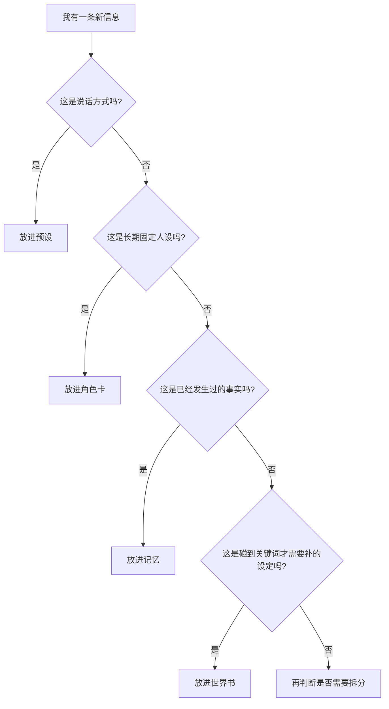

---

## 3.3 什么内容适合放预设

### 典型内容
- 不要抢写用户动作
- 尽量长段落
- 尽量短段落
- 用第二人称
- 避免重复
- 不要太快收尾

### 为什么这么分
因为这些不是角色内容，
而是回复方式。

### 看个例子
信息：

> 不要替用户写动作和台词。

结论：
- 放进预设

原因：
- 这是输出规则，不是设定。

---

## 3.4 什么内容适合放角色卡

### 典型内容
- 角色名字
- 性格
- 身份
- 背景
- 长期价值观
- 核心口吻
- 固定关系立场

### 为什么这么分
因为这些决定的是：

> 这个角色本体是谁。

### 看个例子
信息：

> 雪音是听雨咖啡的经营者，清冷慢热，不轻易袒露心事。

结论：
- 放进角色卡

原因：
- 这是稳定人设，不是临时补充。

---

## 3.5 什么内容适合放记忆

### 典型内容
- 你们一起经历过的事件
- 关系已经推进到哪
- 某个约定已经成立
- 某件事已经发生过

### 为什么这么分
因为它们都是：

> 过去已经发生并应当被记住的事实。

### 看个例子
信息：

> 你已经来过听雨咖啡五次，雪音对你不再像第一次那样疏离。

结论：
- 放进记忆

原因：
- 这是互动累积出来的事实，不是角色天生就有的设定。

---

## 3.6 什么内容适合放世界书

### 典型内容
- 地点设定
- 道具设定
- 组织设定
- 特定话题触发的背景补充
- 某个关键词出现时才需要加入的说明
- 极少数每轮都需要存在、但又不是“输出风格”的长期补充规则

### 为什么这么分
因为世界书最适合处理两类东西：

> 1. “提到某个词时，再临时补进来的东西”
> 2. “少量需要长期参与的常驻补充资料”

### 一个关键词触发例子
信息：

> 提到“听雨咖啡”时，要补充这家店的环境、气味和氛围。

结论：
- 放进世界书

原因：
- 这不是一直都要在场，而是提到关键词时才需要。

### 一个常驻例子
信息：

> 当前故事整体以慢节奏陪伴和关系积累为主，不以激烈主线推进为核心。

结论：
- 可以放进世界书的“常驻”词条

原因：
- 这不是角色本人设定
- 也不是过去已经发生过的事
- 更不是“怎么说话”的输出规则
- 它更像一个需要长期参与的叙事/场景补充

> [!tip]
> 如果一条内容是在管“怎么说”，更像预设。
> 如果一条内容是在管“这个聊天舞台长期是什么样”，更可能是世界书常驻。

---

## 3.7 直接看四个例子，会更好懂

### 例子 1
信息：

> 不要替用户写心理活动。

判断：
- 这是说话方式
- 放进预设

### 例子 2
信息：

> 雪音平时克制，不轻易主动表达需求。

判断：
- 这是长期固定人设
- 放进角色卡

### 例子 3
信息：

> 你昨天离开前和雪音谈到了伦敦，她没有正面回答，但明显受到了触动。

判断：
- 这是已经发生过的事实
- 放进记忆

### 例子 4
信息：

> 当用户提到“伦敦”时，补充雪音与伦敦有关的隐藏背景。

判断：
- 这是关键词触发的补充设定
- 放进世界书

---

## 3.8 如果一条信息好像同时适合两个地方怎么办

这也很常见。

### 解决办法
把它拆开。

### 例子
信息：

> 雪音一直对伦敦有复杂情绪，而昨天你提到伦敦时，她明显沉默了一下。

这里其实是两条信息：

#### 第一条
- 雪音一直对伦敦有复杂情绪
- 更像长期背景
- 可以进角色卡，或者做成世界书里的长期补充词条

#### 第二条
- 昨天你提到伦敦时，她明显沉默了一下
- 这是已发生的事件
- 应该进记忆

### 结论
> 如果一条信息一下放不下，就别硬塞，拆开反而更清楚。

---

## 3.9 最后用一张表收一下

| 你想到的信息 | 更适合放哪 | 原因 |
|---|---|---|
| 不要抢写用户动作 | 预设 | 这是输出规则 |
| 雪音清冷慢热 | 角色卡 | 这是长期人设 |
| 你昨天来过店里 | 记忆 | 这是已发生事实 |
| 提到听雨咖啡时补环境 | 世界书 | 这是关键词触发补充 |

---

## 3.10 本章最后一句话

> [!important]
> 不要问“这个能不能放世界书”。
> 先问：
> **它到底是说话规则、角色本体、过去事实，还是关键词触发补充？**

这个问题想清楚了，模块基本就不会乱放。

---

# 这三章先读完后，你应该已经能做到

- 分清四大模块
- 不再把预设、角色卡、记忆、世界书混在一起
- 遇到一条新信息时，知道该先怎么判断它放哪

---

# 下一步

也就是后面的**第 4～6 章**，会正式开始讲：

1. 世界书最基础的词条长什么样
2. 为什么新增的世界书功能有“角色定义前 / 后 / 聊天内注入”
3. 聊天深度 0~3 到底该怎么理解

> [!tip]
> 到这里，你再去学位置系统、深度、顺序、递归，就不会乱了。

---

# 第 4 章：世界书基础入门

> [!abstract]
> 本章重点：先学会写一条基础世界书词条，分清关键词触发和常驻。位置、深度、递归那些，后面再慢慢加。

> [!info]
> 看到这里，前面那几块你应该已经分得差不多了。
>
> 这一章开始，就正式聊“世界书到底怎么写”。

## 4.1 先用一句话抓住世界书

> 世界书 = **这轮要不要额外补进来的一段设定资料**

最常见的情况当然还是“提到某个词才进来”。  
但你也可以把它做成常驻，让它每轮都参与。

所以说白了，世界书更像一本“按规则加进来的补充资料库”。

### 最简单的想象方式
你可以把它想象成：

- 角色卡 = 演员本人档案
- 世界书 = 道具组、场景组、背景组在拍这场戏前临时塞过来的资料卡

---

## 4.2 一条最基础的世界书，通常就这几块

你第一次写世界书时，不要一上来就管递归、深度、注入顺序。
先把最基础的一条写对。

最基础的一条世界书，至少会有：
![[基础世界书.png]]
- 标题
- 主关键词
- 副关键词
- 内容
- 是否启用

### 你可以先这样理解
#### 标题
这是给你自己看的名字。

#### 主关键词
这是这条世界书最主要的触发词。

#### 副关键词
这是辅助触发词，通常用于补充关联词。

#### 内容
这是这条词条真正要塞进模型的补充设定。

#### 是否启用
决定这条当前参不参与匹配。

---

## 4.3 一个最简单的示例词条

下面这个示例，是整本说明书都会反复用到的主示例：

```md
标题：听雨咖啡
主关键词：听雨咖啡
副关键词：雪音, 店里, 老居民楼
内容：
一家位于老居民楼底层的安静咖啡馆，前身为杂货铺，面积不大，
店内保留水泥墙面与铁皮屋顶。这里适合日常闲聊、关系积累和轻故事展开。
```

### 这条词条实际会干嘛
当用户这轮提到：

- 听雨咖啡
- 或者在你的设置里匹配到了相关关键词

模型就会在这一轮额外拿到这段地点资料。

### 这样做的好处也很直接
你不用把整段地点设定硬塞进角色卡。
而是只有**提到这个地方时**，再把它补进来。

---

## 4.4 主关键词和副关键词，其实可以这样理解

这个地方新手最容易有点懂了、又没完全懂。

### 主关键词
主关键词是：

> 这条词条最核心、最直接的触发词。

比如：

- 听雨咖啡
- 雪音
- 伦敦

这些通常都适合作为主关键词。

### 副关键词
副关键词是：

> 用来补充触发范围的关联词。

比如“听雨咖啡”这条，副关键词可以写：

- 店里
- 老居民楼
- 吧台区

它的作用是让这条词条在更自然的上下文里，也有机会被命中。

### 新手要注意的地方
> [!warning]
> 副关键词不是越多越好。
>
> 如果你把太泛的词也塞进去，比如：
> - 日常
> - 安静
> - 关系
> - 聊天
>
> 那这条世界书就可能到处乱触发。

---

## 4.5 什么叫关键词触发和常驻

在当前系统里，世界书不仅能做“关键词触发”，也能做“常驻”型条目。

### 关键词触发
意思是：

> 只有这轮匹配到了关键词，这条才进来。

这是最常见、最适合新手上手的模式。

### 常驻
意思是：

> 不管这轮提没提到关键词，这条都长期参与。

它不是“关键词没写全所以乱进来”，
而是你本来就明确告诉系统：

> 这条世界书不依赖关键词，本来就要长期参与。

---

### 常驻什么时候适合用

常驻最适合放的是：

- 少量长期存在的场景补充
- 极少数全局叙事基调补充
- 不属于角色卡，也不属于预设输出规则，但又不适合等关键词才出现的内容

#### 示例
```md
标题：长期叙事基调
触发类型：常驻
内容：
当前故事以慢节奏、长期陪伴、关系积累为主，
不以激烈主线推进为核心。
```

这条就很适合常驻。
因为它不是“提到某个词才该出现”的信息，
而是整个聊天长期都成立的一层补充。

---

### 关键词触发什么时候适合用

关键词触发适合放的是：

- 地点设定
- 特定话题的补充
- 某个角色的隐藏背景
- 道具说明
- 只有提到特定词才需要出现的内容

#### 示例
```md
标题：听雨咖啡
触发类型：关键词触发
主关键词：听雨咖啡
内容：
听雨咖啡是一家位于老居民楼底层的安静小店……
```

这条就适合关键词触发。
因为只有在你真的提到“听雨咖啡”时，它才值得进来。

---

### 常驻不等于预设

这是特别容易搞混的一点。

#### 更像预设的内容
- 不要抢写用户动作
- 用长段落
- 用第二人称
- 减少重复

这些是在管：

> **怎么说**

所以它们更像预设。

#### 更像世界书常驻的内容
- 当前故事长期以慢节奏陪伴为主
- 当前主要舞台是一个长期陪伴式咖啡馆场景
- 这个阶段聊天整体不强调激烈主线推进

这些是在管：

> **这个聊天舞台长期是什么样**

所以它们更像 世界书常驻。

---

### 一张对照表

| 类型 | 什么时候适合用 | 典型内容 |
|---|---|---|
| 关键词触发 | 只有提到某个词时才需要补 | 地点、道具、特定话题补充 |
| 常驻 | 每轮都需要参与，但又不是输出风格 | 长期叙事基调、少量全局场景补充 |
| 预设 | 这是“怎么说”的规则 | 不抢话、长段落、第二人称 |

> [!tip]
> 刚开始用的时候，还是更建议你先用关键词触发。
> 常驻只给**极少数**真正需要长期参与的补充规则。
>
> 因为常驻条目一多，prompt 会明显变厚，后面排错也会麻烦很多。

---

## 4.6 什么叫主副组关系

你现在的世界书里，不只是“单词触发”，还有主副组关系这种更细一点的控制。

简单一点说：

- 主关键词是一组
- 副关键词是一组
- 你可以决定它们之间的关系是更宽松，还是更严格

### 新手先怎么理解最够用
先别想太复杂，先记这个：

- 想让词条更容易触发 → 放宽
- 想让词条更精确触发 → 收紧

也就是说，主副组关系本质上是在决定：

> **“这条词条到底要多容易被命中”**

---

## 4.7 概率、顺序、黏性、冷却，别被名字吓到

这一部分很多人第一次看会觉得一堆名词，但其实都可以白话理解。

### 概率
意思是：

> 命中了，也不一定每次都进，可以按概率决定。

比如你想做一点随机感，就可以用它。
但新手前期建议先别碰，先都设成 100%。

### 顺序
意思是：

> 多条世界书同时命中时，谁更优先。

这个是旧世界书体系里就很常见的排序思路。

### 黏性
意思是：

> 命中后，这条还能额外跟随几轮。

它适合“本轮提了一次，但后面几轮还想保留一点影响”的情况。

### 冷却
意思是：

> 这条刚触发过，接下来几轮先别又重复进来。

它适合避免某些条目太频繁刷屏。

---

## 4.8 新手第一阶段推荐怎么写世界书

如果你是第一次写世界书，我还是更建议你先用这套最小配置：

- 关键词触发
- 概率 = 100
- 黏性 = 0
- 冷却 = 0
- 顺序先别折腾
- 先只写标题、关键词、内容

### 先学会这件事
> 一条世界书能不能在你提到关键词时，稳定、可预测地进来

先把这件事跑通，比一上来折腾概率、冷却、复杂逻辑更重要。

---

## 4.9 一个好用的地点词条示例

```md
标题：听雨咖啡
主关键词：听雨咖啡
副关键词：吧台, 老居民楼, 铁皮屋顶
内容：
听雨咖啡是一家位于老居民楼底层的小店，面积不大，
保留着水泥墙面与铁皮屋顶。这里更适合日常闲聊、关系积累和轻故事展开，
没有很强的主线压力，雨声是这家店的重要氛围来源。
```

### 这条为什么适合做新手示例
因为它满足：

- 很具体
- 关键词清楚
- 内容和主题统一
- 不会一眼就和角色卡、记忆搞混

---

## 4.10 这一章结束

> [!tip]
> 相信大家都已经理解了世界书的基础该如何使用，对于写卡方面，更像一个大型的提示词触发。
> 
> 世界书最重要的不是“写得多”，它真正的意思是：
>
> **关键词清楚、内容聚焦、触发可预测。**

---

# 第 5 章：位置系统——为什么这些新增的世界书功能更强

> [!abstract]
> 本章重点：把三种位置先分清。先知道它们分别在干嘛，再谈效果差别。

> [!important]
> 这一章其实很关键。
>
>在上一章我们学会了将世界书变成一个大型的提示词触发器。而在这一章，我们将学会把世界书变成真正的导演剪辑器。
>
> 以前很多人理解世界书，脑子里就一句话：命中了，就塞进去。  
> 但现在不一样了。你这套系统已经能把世界书放到不同位置里，同样一条设定，放的位置一变，体感就会变。

## 5.1 先想明白：同样是世界书，为什么还要分位置

因为世界书虽然都在补设定，但补的东西本身就不在一个层级上。

有的内容更偏向：

- 世界框架
- 角色出场前就必须知道的背景

有的内容更偏向：

- 角色额外说明
- 当前轮临时补丁

还有的内容更偏向：

- 当前回答前的即时提醒
- 导演在镜头开拍前轻声提醒一句

所以，把所有世界书都扔到同一层，其实就会显得不够细。

---

## 5.2 你现在这套系统里，位置一共三种

### 1）角色定义前
英文标识通常是：

```text
before_char_defs
```

### 2）角色定义后
英文标识通常是：

```text
after_char_defs
```

### 3）聊天内注入
英文标识通常是：

```text
in_chat
```

---

## 5.3 用“三层楼”来理解三种位置

这个比喻基本是这一章里最好懂的那个。

### 第一层：角色定义前
像是：

> 角色上场前，先交代这个世界的框架

适合放：
- 世界观硬规则
- 背景框架
- 角色出场前必须知道的条件

### 第二层：角色定义后
像是：

> 角色已经上场了，再补一句这一轮特别 relevant 的角色说明

适合放：
- 角色补丁
- 阶段性背景
- 某个角色的补充设定

### 第三层：聊天内注入
像是：

> 当前镜头开拍前，导演贴耳提醒一句

适合放：
- 本轮即时状态
- 当前情绪提醒
- 当前话题下的瞬时反应
- 近场导演提示

---

## 5.4 角色定义前适合放什么

这一层最适合放：

- 世界规则
- 地点的大框架
- 门派规则
- 时代背景
- “只要这个角色出场，你最好先知道”的框架性信息

### 示例
```md
标题：听雨咖啡的世界背景
位置：角色定义前
内容：
听雨咖啡是一个以日常陪伴和关系积累为主的长期聊天场景，
没有紧迫主线，更强调慢节奏互动与来访次数带来的变化。
```

### 为什么更适合放这里
因为这不是“雪音个人的某个小心思”，
而是这个聊天舞台本身的背景框架。

---

## 5.5 角色定义后适合放什么

这一层更适合放：

- 角色补丁
- 当前阶段的关系说明
- 某个角色的额外背景
- 某个关键词命中后，对角色的补充解释

### 示例
```md
标题：雪音的伦敦补充背景
位置：角色定义后
关键词：伦敦
内容：
雪音对伦敦并不是普通兴趣，她和这个地名之间有较深的私人情绪，
平时不会主动谈起，但一旦被提到，会明显收敛表情与语气。
```

### 为什么更适合放这里
因为它其实更像：

> “关于雪音这个人，这轮你最好再多知道一点”

它不属于纯世界规则，也不只是当前一瞬间的提醒。

---

## 5.6 聊天内注入适合放什么

这一层最适合放：

- 本轮即时提醒
- 当前状态
- 当前轮才需要特别强调的临时信息
- 非常贴近这一句回复的导演提示

### 示例
```md
标题：提到伦敦时的即时反应
位置：聊天内注入
关键词：伦敦
内容：
这轮提到伦敦时，雪音的神情会有一瞬停顿，但她不会马上把真正原因说出来。
```

### 为什么更适合放这里
因为这不是长期设定本体，
它其实更像：

> “这一轮回复时，你要记得她会有这个即时反应”。

---

## 5.7 用一张图把三种位置捋顺

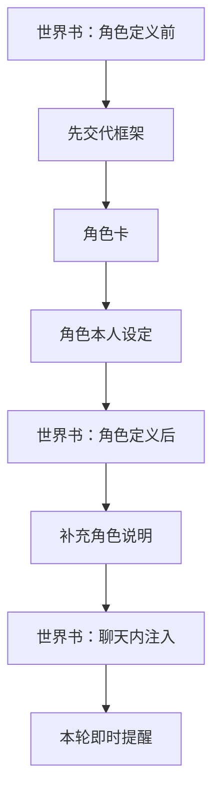

---

## 5.8 为什么同样一条内容，放的位置不同，效果会不同

这个点新手最好先想明白。

### 比如同一句内容：
> 提到伦敦时，雪音会情绪微妙地收紧。

如果你放在：

#### 角色定义前
它会更像世界规则的一部分，偏硬、偏框架。

#### 角色定义后
它会更像“雪音这个角色的补充说明”。

#### 聊天内注入
它会更像“这轮你马上要写回复时的即时提醒”。

### 所以说白了真正重要的不是：
> 这句内容写得漂不漂亮

它真正的意思是：

> 这句内容**该在哪一层出现**

---

## 5.9 新手最常犯的一个错误

> [!warning]
> 把所有世界书都丢到同一个位置。

这样做当然能跑，但你会很快发现：

- 框架和即时提醒混在一起
- 世界观和角色补丁混在一起
- 很难判断“到底是哪一层在起作用”

### 新手更稳的做法
先按这三个原则分：

#### 先放角色定义前
如果它是：
- 世界框架
- 地点框架
- 长期背景

#### 先放角色定义后
如果它是：
- 角色补丁
- 阶段说明
- 背景补充

#### 先放聊天内注入
如果它是：
- 当前轮提醒
- 即时反应
- 导演提示

---

## 5.10 一个完整的三层示例

### 词条 A：听雨咖啡世界框架
- 位置：角色定义前

### 词条 B：雪音的伦敦背景
- 位置：角色定义后

### 词条 C：这轮提到伦敦时的即时反应
- 位置：聊天内注入

这样同样围绕“伦敦”这个主题，你就已经能做出明显分层了。

---

## 5.11 这一章最后记住这三句

> [!tip]
> - 角色定义前：先讲框架
> - 角色定义后：再补角色
> - 聊天内注入：贴近本轮提醒

---

# 第 6 章：聊天深度怎么理解

> [!abstract]
> 本章重点：只讲聊天内注入的深度。记住一句话：**数字越小，越靠近当前回复。**

> [!info]
> 这一章只讲 **聊天内注入**。
>
> 因为“深度”只对聊天内注入最重要。

## 6.1 什么是深度

如果你已经决定一条世界书要放在：

```text
in_chat
```

那你还可以继续决定：

> 这条提醒离当前回复有多近。

这时候就要用到“深度”。

当前系统里，深度一般会用：

- 0
- 1
- 2
- 3

来表示。

---

## 6.2 数字越小，越靠近当前回复

这是整章最重要的一句。

> **数字越小，越靠近当前这一轮。**

换句话说：

- 深度 0：最贴近当前回复，影响最强
- 深度 1：稍远一点
- 深度 2：再远一点
- 深度 3：更像较远的背景提醒

---

## 6.3 先用一张图感受一下深度

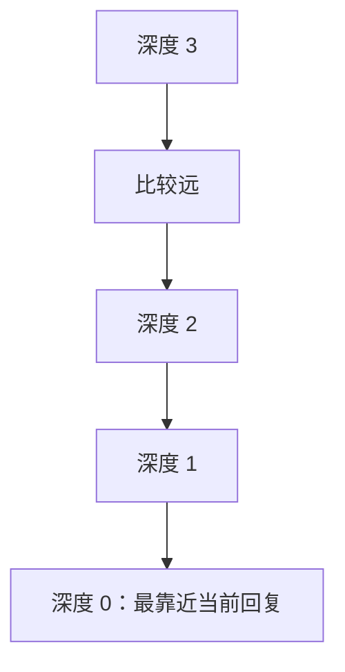

---

## 6.4 用“导演站位”来理解深度

这个比喻最好懂。

### 深度 0
像导演直接站在你耳边说：

> 这句回复前，记得她现在正在忍住情绪。

### 深度 1
像导演站在你旁边提醒：

> 记得，她刚才听到这句话的时候，神色已经有点变了。

### 深度 2
像导演在镜头外说：

> 这条线还在，你心里带着就行，不用现在一下写得太重。

### 深度 3
像更远处的背景说明：

> 这件事跟现在这段对话还是有关，只是已经不是眼前这句最主要的重点了。

---

## 6.5 为什么要分深度

因为“聊天内注入”也不全是同一种提醒。

有些提醒是：

- **这句马上要用**
- 非常近
- 非常强

有些提醒只是：

- 还算相关
- 但不需要压在这一句最前面

如果都堆在一起，你就会失去这种细腻差别。

---

## 6.6 一个最直观的对比例子

### 深度 0 示例
```md
标题：伦敦即时反应
位置：聊天内注入
深度：0
内容：
这一轮提到伦敦时，雪音会有很明显的一瞬停顿。
```

### 深度 2 示例
```md
标题：伦敦背景残留
位置：聊天内注入
深度：2
内容：
雪音和伦敦相关的话题长期存在潜在情绪，但并不会每次都强烈外显。
```

### 体感区别
#### 深度 0
更偏向：
- 当前这句话立刻生效
- 模型很容易把它写进正在生成的反应里

#### 深度 2
更偏向：
- 还在背景里
- 但不是最强的当前驱动力

---

## 6.7 刚开始用深度时，建议这样来

> [!tip]
> 如果你对深度还没什么手感，先这样用最稳：

### 先用深度 0
适合：
- 当前轮即时提醒
- 这句必须记住的状态
- 导演贴耳提示

### 再尝试深度 2
适合：
- 比较远一点的背景提醒
- 本轮相关，但不必特别顶脸

### 暂时别急着大量用 1 和 3
因为新手前期最重要的不是“深度用得细”，
而是先明确感觉到：

> 深度 0 比深度 2 更近、更强。

---

## 6.8 一个完整例子：同一个话题，不同深度

主题还是“伦敦”。

### 条目 A
- 深度 0
- 内容：她听到伦敦时会有一瞬停顿

### 条目 B
- 深度 2
- 内容：她对伦敦一直有复杂情绪

你会发现，其实就是这么回事：

- A 更像当前句子的即时导演提示
- B 更像本轮背景残留

这就是深度分层最有意思、也最有用的地方。

---

## 6.9 新手最常见误区

### 误区 1：以为数字越大越强
错。

正确理解是：

> 数字越小，越靠近当前回复。

### 误区 2：以为深度只是装饰数字
错。

深度的意义就在于：

> 决定这条聊天内世界书离当前回复到底有多近。

### 误区 3：一开始就把所有聊天内词条分成四层
不太建议。

更稳的做法是：
- 先用 0
- 再试 2
- 等你体感稳定了，再细分 1 和 3

---

## 6.10 最后把这个点记住

> [!important]
> 这一章最核心的点就一句：**数字越小，越靠近当前回复。**
>
> 先学会分清：
> - 深度 0 = 即时提醒
> - 深度 2 = 稍远背景

这比一开始把 0、1、2、3 全部玩花更重要。

---

# 这一阶段学完后，你应该已经能理解

1. 一条基础世界书怎么写
2. 为什么位置不同，效果不同
3. 为什么聊天内注入还要继续分深度

---

# 下一步预告

接下来的第 7～9 章，会开始讲：

- 顺序怎么控制
- 递归 V1 怎么理解
- 世界书设置页怎么用

> [!tip]
> 到这里，你就会开始真正进入“当前这些新增的世界书功能”的核心部分。
> 
> 同样，也是区分写手的分水岭


---

# 第 7 章：顺序怎么控制

> [!abstract]
> 本章重点：先理解“同层比较”这个前提，再理解注入顺序为什么主要用来控制同一层里的先后。

> [!info]
> 看到这里，你前面这些东西应该已经有概念了：
> - 世界书可以放在不同位置
> - 聊天内注入还能分深度
>
> 现在要学的是：
> **如果同一轮命中了多条世界书，它们谁先谁后？**

## 7.1 为什么要有“顺序”

因为世界书不是每次只命中一条。

很多时候会出现这种情况：

- 你提到了一个地点
- 同时命中了地点词条
- 又命中了人物词条
- 还命中了一个本轮即时提醒词条

这时候系统就得决定：

> 到底谁排前面，谁排后面。

如果没有顺序控制，多条词条挤在一起时会很乱。

---

## 7.2 先用最白的话把“顺序”说清楚

顺序的本质就是：

> **多条世界书一起出现时，谁更靠前。**

你可以把它理解成：

- 同时有三个人举手发言
- 总得决定先听谁，再听谁

---

## 7.3 为什么现在会有两种“顺序”

当前这些新增的世界书功能里，最容易让人绕进去的就是：

- 旧的“顺序”
- 新的“注入顺序”

第一次接触这个东西，不用紧张，先这样理解就够用了。

### 旧顺序
旧顺序更偏向：

> 这条词条在整体世界书体系里的基础优先级

### 注入顺序
注入顺序更偏向：

> **当它已经进入同一层以后，在这一层里谁排前面**

换句话说：

- 先决定是不是进入这一层
- 进入这一层以后，再决定它在这一层里的前后顺序

---

## 7.4 最简单的理解方式

> [!tip]
> 先别把“顺序”和“注入顺序”想得太抽象。
>
> 对新手来说，先记这句就够了：
>
> **注入顺序主要用来控制同一层里的前后。**

也就是：

- 如果两条词条都在“角色定义后”
- 或者都在“聊天深度 0”

那这时谁先谁后，就主要看注入顺序。

---

## 7.5 一个最直观的例子

我们用两条同层词条来解释。

### ORDER_A
- 关键词：同层顺序词
- 插入位置：角色定义后
- 注入顺序：10

### ORDER_B
- 关键词：同层顺序词
- 插入位置：角色定义后
- 注入顺序：200

如果这两条同时命中，那么结果通常会是：

- ORDER_A 在前
- ORDER_B 在后

因为：

> 注入顺序越小，越靠前。

---

## 7.6 这个东西，看图最快

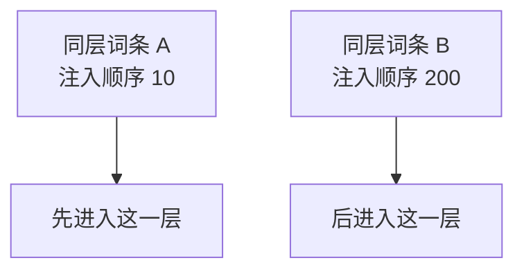

---

## 7.7 为什么“同层”这个前提很重要

这里一定要特别注意：

> 顺序比较最有意义的时候，是**同一层里的比较**。

比如：

- 一条在角色定义前
- 一条在角色定义后
- 一条在聊天内注入

这三条本身就不在同一个位置，
它们首先受“位置分层”影响，
不是先拿注入顺序硬拼。

所以新手一定要分清：

### 第一步
先看它们在哪一层

### 第二步
如果它们在同一层，再看谁排前面

---

## 7.8 新手实际该怎么用顺序

### 最稳的起步方式
刚开始不要到处乱改顺序。

建议：

- 普通条目先保持默认
- 只有当你真的发现“同层里有两条在抢位置”时，再去调注入顺序

### 什么时候该调
比如：

- 两条都是角色定义后
- 但你明显希望其中一条更早起作用

或者：

- 两条都是聊天深度 0
- 你希望“即时提醒 A”先于“即时提醒 B”

这时再改顺序就很有价值。

---

## 7.9 一个简单经验法则

### 想让它更靠前
就把注入顺序调小一点

### 想让它更靠后
就把注入顺序调大一点

### 如果你还不确定
先别改太多。
先把差距拉明显，比如：

- 10
- 100
- 200

这样测试最容易看出来。

---

## 7.10 顺序和位置、深度的关系

这三个东西不是一个层级的问题。

### 位置
决定它在哪一大层

### 深度
决定聊天内注入时，离当前回复有多近

### 注入顺序
决定同一层里谁先谁后

### 你可以这样记
> [!tip]
> - 位置 = 楼层
> - 深度 = 离当前回复的远近
> - 注入顺序 = 同一层里排队顺序

---

## 7.11 新手最常见误区

### 误区 1：以为顺序越大越优先
不对。

通常是：
> 数值更小，更靠前。

### 误区 2：以为注入顺序能跨层压过去
不对。

如果一条在角色定义前，一条在聊天内注入，
首先看的不是注入顺序，而是它们本来就不在同一层。

### 误区 3：一开始就给所有条目精细调顺序
不太建议。

更稳的做法是：
- 先让条目正确命中
- 再让它们进入正确层
- 最后才微调同层顺序

---

## 7.12 最后记住这一句就够了

> [!important]
> 顺序这个东西，最后就记一句：**先看在哪一层，再看同层谁在前。**

---

# 第 8 章：递归 V1 怎么理解

> [!abstract]
> 本章重点：把递归想简单一点。它不是自动乱扩展，而是“一条设定继续带出另一条相关设定”。

> [!info]
> 这一章开始聊一个稍微进阶一点、但也很好用的东西：递归。
>
> 不过这里不讲复杂版，就讲新手先该懂的那一层。

## 8.1 先用一句大白话理解递归

递归的意思其实很简单：

> **一条世界书命中以后，还能顺手把别的相关世界书带出来。**

也就是说，不再只是：

- 用户提到 A
- 命中 A
- 结束

它真正的意思是：

- 用户提到 A
- 命中 A
- A 又带出 B
- B 还可能再带出 C

---

## 8.2 为什么要做递归

因为现实里的设定往往不是孤立的。

比如：

- 你提到“听雨咖啡”
- 这很自然会联想到“雪音”
- 提到“雪音”又可能带出“伦敦念想”

如果没有递归，你可能要把一堆东西都手工写死。
有了递归以后，设定之间就能形成链。

---

## 8.3 递归 V1 的核心逻辑

你现在这版递归，最适合新手理解的方式是：

### 第 0 层
先正常用**用户输入**匹配世界书

### 第 1 层开始
再拿已经命中的词条，继续去带出下一批词条

换句话说：

```text
用户输入
→ 命中第一批
→ 第一批再带出第二批
→ 第二批再带出第三批
```

---

## 8.4 递归 V1 当前先用什么做“递归线索”

在目前版本内能够触发递归的只有：

> - `title`
> - `trigger`
> - `secondary_trigger`

换句话说：

- 先用词条标题
- 再用主关键词
- 再用副关键词

来做递归。

### 为什么先不急着把正文也拿来递归
因为正文内容一旦也拿去做递归，会变得更强，但也更容易扩散。

新手第一阶段最重要的是：

> 先让递归**稳定、可预测**，
> 而不是一上来就让它“特别会带”。

---

## 8.5 一个最适合新手理解的递归例子

我们继续用Aca写的标准卡作为统一的主线例子。

### 用户输入
```text
我推门走进听雨咖啡。
```

### 第 0 层命中
命中词条：

- 听雨咖啡

### 第 1 层递归
因为“听雨咖啡”这条词条的：
- 标题
- 关键词
- 副关键词

可能关联到：

- 雪音

所以第 1 层继续命中：

- 雪音

### 第 2 层递归
而“雪音”这条又可能关联到：

- 伦敦念想

于是再命中：

- 伦敦念想

递归最直观的感觉，大概就是这样：一条带一条，再往下带。

---

## 8.6 这个过程，用图看最直观

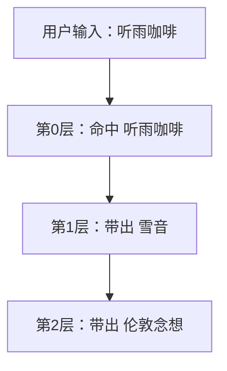

---

## 8.7 递归不是会一直无限往下跑

这个地方挺重要。

递归一定要有停止条件。
不然就会无限套娃。

### 常见停止方式
- 到了最大递归层级
- 这一层没有新命中
- 某条词条设置了“命中后阻止继续递归”

### 所以递归不是：
> 一开就失控

它更像是：
> 按规则一层层往外扩，扩到该停的时候就停

---

## 8.8 什么叫“允许递归参与”

这一项很好理解。

如果一条词条：

- 开启了“允许递归参与”

那它就可以被递归链带出来。

如果一条词条：

- 没开启

那它更像只允许“用户直接提到时命中”，
而不允许被别的词条继续带出。

### 什么时候适合关掉
比如某些词条你只想让它：

- 用户直提时出现
- 不想让它在递归里到处冒出来

这时就可以关掉。

---

## 8.9 什么叫“命中后阻止继续递归”

这个更像“递归终点开关”。

意思是：

> 这条词条可以被命中，
> 但命中到这里就够了，别再继续往后扩。

### 什么时候适合开
比如某条词条本身已经是：
- 最终解释
- 终点说明
- 你不想再往后带更多关联

那它就很适合做递归终点。

---

## 8.10 为什么递归不是越深越好

> [!warning]
> 这是新手非常容易误判的地方。

很多人会以为：

- 层级越深
- 带出的东西越多
- 世界书就越强

其实不是。

### 深了以后会发生什么
- 命中会变多
- 信息会变杂
- 更容易把不该进来的设定也带出来
- 调试更难看懂

所以对新手来说：

> **递归稳定，比递归很深更重要。**

---

## 8.11 新手第一阶段怎么用递归最稳

更稳一点的话，可以这样来：

### 第一步
先不开递归，先把普通世界书跑顺

### 第二步
只对少数明显有关联的词条开递归
比如：
- 听雨咖啡
- 雪音
- 伦敦念想

### 第三步
最大层级先设低一点
比如：
- 1
- 或 2

### 第四步
先只观察：
- 它能不能稳定从 A 带出 B
- 再从 B 带出 C

不要一开始就追求复杂网络。

---

## 8.12 这一章最后收一句

> [!important]
> **递归不是自动乱扩展，它真正的意思是：**
>
> **一条设定，继续带出相关设定。**

---

# 第 9 章：世界书设置页怎么用

> [!abstract]
> 本章重点：设置页管整体规则，词条页管具体内容。不要把两者混在一起。

> [!info]
> 到这一章，你已经懂了：
> - 什么是世界书
> - 什么是位置
> - 什么是深度
> - 什么是递归
>
> 现在要学的是：
> **世界书设置页到底在控制什么。**

## 9.1 设置页不是写词条的地方

这里先说清楚。

### 世界书设置页管什么
它管的是：

- 总开关
- 命中上限
- 默认行为
- 默认触发类型（关键词触发 / 常驻）
- 默认位置
- 默认深度
- 递归总开关
- 最大递归层级

### 世界书词条页管什么
它管的是：

- 每一条词条本身的内容
- 关键词
- 位置
- 深度
- 顺序
- 递归开关

### 一句话区别
> 设置页管“整体规则”，词条页管“每条内容”。

---

## 9.2 启用 / 停用世界书

这是最简单的一项。

### 启用
表示：
- 世界书系统参与本轮工作

### 停用
表示：
- 本轮直接不走世界书

### 新手什么时候该关
如果你在排查问题时，想确认：

> “是不是 世界书在影响这轮回复”

就可以临时关掉来对照测试。

---

## 9.3 默认触发类型是什么

这一项控制的是：

> 新建世界书词条时，默认更偏向哪一种触发方式。

通常会有两类：

- 关键词触发
- 常驻

### 新手推荐
前期默认先用：

```text
关键词触发
```

因为它更好理解，也更容易测试。

### 什么时候可以默认改成常驻
只有在你这段时间主要在整理：

- 少量长期叙事基调
- 少量全局场景补充

这种明确就是“每轮都要参与”的条目时，
才值得短暂改成常驻。

> [!warning]
> 不建议把“常驻”当成默认习惯。
> 因为新手很容易一不小心把太多条目都做成常驻。

---

## 9.4 什么是每轮最多命中条数

这一项非常重要。

它不是在说：

> 世界书总共有多少条

它真正的意思是：

> **单次回复里，最终最多允许多少条命中的世界书进入 prompt**

### 还是拿个例子来说
假设你有 100 条世界书。
这一轮里其中 7 条都命中了。

如果你设置：

```text
max_hits = 3
```

那最终只会保留其中 3 条。

---

## 9.5 为什么要有命中上限

因为世界书一多以后：

- 同一轮可能命中很多条
- prompt 会变得很厚
- 模型不一定更稳定，反而可能更乱

所以命中上限的作用就是：

> **控制一轮里最终塞进去的世界书数量**

---

## 9.6 新手推荐怎么设命中上限

### 新手推荐
- 3
- 或 5

这样比较稳。

### 为什么这么分不建议一开始就开很大
因为：
- 你还在学习调试
- 命中越多越难排查
- 很容易不确定是哪条在起作用

---

## 9.7 默认位置是什么

默认位置的作用是：

> 如果一条新词条没有单独设置位置，那它先按这里的默认值走。

### 新手推荐默认值
通常建议先用：

```text
角色定义后
```

因为这通常最稳，也最容易感受到效果。

### 什么时候适合改默认位置
如果你最近正在批量写：

- 世界观框架词条
那默认位置可以先改成：
- 角色定义前

如果你最近正在写：

- 当前轮即时提醒词条
那默认位置可以先改成：
- 聊天内注入

---

## 9.8 默认聊天深度是什么

这项主要影响：

- 新建词条时
- 或者旧词条缺失深度字段时

默认先补成什么深度。

### 新手推荐
默认先设：

```text
0
```

因为最容易观察效果。

---

## 9.9 默认注入顺序是什么

这项的作用是：

- 词条没单独写注入顺序时
- 先拿这个值做默认

### 新手推荐
先保持一个中间值就够了，比如：

```text
100
```

后面真的需要比较 A/B 谁靠前时，再细调。

---

## 9.10 递归总开关是什么

这项控制的是：

> 整个世界书系统要不要启用递归匹配

### 开启后
- 世界书不仅能直接命中
- 还可以继续带出下一层词条

### 关闭后
- 只有用户输入直接命中的词条会参与
- 不继续展开

### 新手建议
前期先关。
等你基础世界书稳了，再开递归。

---

## 9.11 最大递归层级是什么

它决定的是：

> 递归最多往下走几层

### 举例
如果最大层级设成 2，大概就是：

- 第 0 层：用户输入直接命中
- 第 1 层：第一跳递归
- 第 2 层：第二跳递归
- 再往后就停

### 新手推荐
先用：
- 1
- 或 2

就够了。

---

## 9.12 新手最推荐的一套默认设置

如果你刚开始接触这些新增的世界书功能，我更建议先这样配：

```text
世界书启用：开
每轮最多命中条数：3
默认插入位置：角色定义后
默认聊天深度：0
默认注入顺序：100
递归总开关：关
最大递归层级：2
```

### 为什么这么分这套很适合起步
因为它的好处大概是：

- 简单
- 稳
- 好观察
- 不容易一下子命中太多

---

## 9.13 最后用一张图看设置页在管什么

 
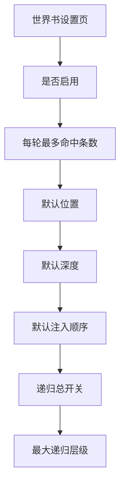
---

## 9.14 这一章最后留一句

> [!tip]
> 设置页不是写内容的地方，
> 设置页是在决定：
>
> **世界书系统整体怎么工作。**

---

# 这一阶段学完后，你已经理解了

1. 同层世界书怎么排先后
2. 递归 V1 的基本逻辑
3. 设置页到底是在控制什么

---

# 下一步

接下来的第 10～12 章，会继续讲：

- 世界书词条页怎么用
- 导入与导出怎么理解
- 批量编辑怎么用

> [!important]
> 到这里，你就已经不只是“理解世界书与新增功能”，而是开始真正会用这套新系统了。

---

# 第 10 章：世界书词条页怎么用

> [!abstract]
> 本章重点：把脑子里的设定，变成一条真正能保存、能测试、能排错的世界书词条。

> [!info]
> 到这一章开始，你已经不是只在“理解系统”，而是在真正学会怎么操作它。

这一章很简单，就是想带你把这件事做出来：

> 教你把“我脑子里的设定”变成一条真正能用的世界书词条。

---

## 10.1 先理解：词条页是干什么的

如果说：

- **设置页**负责决定世界书系统整体怎么工作
- 那么**词条页**负责的就是：
  - 每一条词条写什么
  - 怎么触发
  - 放哪一层
  - 顺序怎么排
  - 递归开不开

你可以把它理解成：

> 设置页管“规则”，词条页管“内容”。

---

## 10.2 新手第一次打开词条页，会看到什么
![[Pasted image 20260423213808.png]]
![[Pasted image 20260423213837.png]]
词条页通常最重要的区域有这些：

- 当前条数
- 新增词条
- 保存全部词条
- 重新读取
- 导入世界书
- 导出世界书
- 搜索框
- 每条词条的编辑卡片

### 新手先记最重要的三件事
1. **新增词条**
2. **保存全部词条**
3. **去聊天页测试**

先把这三步跑顺，其他稍微高级一点的东西都可以慢慢来。

---

## 10.3 一条词条最基础的填写顺序

如果你是第一次写，别一上来就把每个输入框全填满。

建议按这个顺序来：

### 第一步：写标题
标题是给你自己看的。
要写得一眼就知道它讲什么。

比如：
- 听雨咖啡
- 雪音
- 伦敦念想
- 提到伦敦时的即时反应

### 第二步：写主关键词
这是最主要的触发词。
先只写最核心的那个。

比如：
- 听雨咖啡
- 雪音
- 伦敦

### 第三步：写内容
内容只写这一条最想补的设定。

### 第四步：先选触发类型，再选位置
先想清楚它到底是：

- 关键词触发
- 还是常驻

#### 如果是关键词触发
说明它其实更像：
- 提到某个地点
- 提到某个话题
- 提到某个道具
- 才需要出现

#### 如果是常驻
说明它其实更像：
- 每轮都应该长期参与的少量补充规则

然后再决定它其实更像：
- 框架
- 角色补丁
- 当前轮即时提醒

最后再选：
- 角色定义前
- 角色定义后
- 聊天内注入

### 第五步：保存
不要写完一堆不保存。

### 第六步：去聊天页测试
这个步骤其实很重要。
新手最大的问题不是“不会写”，它真正的意思是：

> 写完以后不马上测试，最后根本不知道哪条在生效。

---

## 10.4 第一次写词条，我建议你只填这些

如果你现在还是新手，第一批词条建议只填：

- 标题
- 触发类型
- 主关键词（如果它不是常驻）
- 内容
- 插入位置
- 是否启用

其他东西先别碰太多。

### 为什么这么分
因为你要先验证的是：

> 这条词条能不能稳定地在该出现的时候出现

不是一上来就追求：
- 很复杂的副关键词
- 很精细的顺序
- 很复杂的递归

---

## 10.5 一个最稳的新手词条示例

### 示例：听雨咖啡
```md
标题：听雨咖啡
主关键词：听雨咖啡
内容：
听雨咖啡是一家位于老居民楼底层的安静小店，
保留着水泥墙面和铁皮屋顶。这里适合日常闲聊、关系积累与慢节奏互动。
插入位置：角色定义前
启用：是
```

### 为什么这么分它适合新手
因为它：

- 名字明确
- 关键词明确
- 内容集中
- 不容易和角色卡混
- 触发时非常容易测试

---

## 10.6 一条词条写完以后，怎么知道自己有没有写对

最稳的方法不是凭感觉，
而是按这个顺序检查：

### 1）关键词够不够明确
是不是一眼就知道触发词是什么

### 2）内容是不是太散
是不是一条词条里塞了太多不相干的东西

### 3）位置是不是选对
它到底更偏向：
- 框架
- 角色补丁
- 即时提醒

### 4）保存了没有
这个很重要

### 5）聊天页测试了没有
用关键词直接触发一次

---

## 10.7 搜索怎么用

当你的词条多起来后，搜索会变得非常重要。

### 搜索适合做什么
- 找某个词条
- 找一组相关词条
- 批量整理前先筛选目标

### 示例
如果你搜索：

```text
伦敦
```

那你应该能很快定位：
- 伦敦念想
- 伦敦地标
- 伦敦旧照片
- 提到伦敦时的即时反应

### 新手建议
以后写 Worldbook 时，尽量让标题和内容都足够清楚。
这样后面搜索、整理会轻松很多。

---

## 10.8 从新增词条到实际测试，走一遍完整流程

这一段建议你在本文中做成“照抄式操作步骤”。

### 示例流程
1. 打开词条页
2. 点“新增词条”
3. 填标题：听雨咖啡
4. 填主关键词：听雨咖啡
5. 填内容
6. 选择位置：角色定义前
7. 点“保存全部词条”
8. 回聊天页输入：
   > 我推门走进听雨咖啡。
9. 看 Prompt Preview（提示词预览） / Debug

如果能看到它命中并进入对应位置，说明这条写对了。

---

## 10.9 新手最常见的词条页错误

### 错误 1：写完不保存
你在页面上看到了，不代表后端已经存了。

### 错误 2：一条词条塞太多东西
比如：
- 地点
- 人物
- 道具
- 过去事件
- 世界规则
全塞进一条

这样后面排错会非常痛苦。

### 错误 3：标题太模糊
比如：
- 设定 1
- 补充
- 规则
这种标题后期根本不好找。

### 错误 4：位置不分
全扔到角色定义后，前期可以凑合，后期会越来越乱。

---

## 10.10 最后留一句最实用的

> [!tip]
> 刚开始别贪多。先写一条最简单、最明确、最好测的词条。
>
> 先让它稳定命中，后面再慢慢加复杂度。

---

# 第 11 章：导入与导出怎么理解

> [!abstract]
> 本章重点：导入不是重点，**导入后字段怎么补、怎么保留**才是重点。

> [!info]
> 这一章讲的是：
>
> - 为什么旧包也能导
> - 为什么导入后有时会跟随默认
> - 为什么新版包会保留自己的位置和深度
> - 导入增强到底帮你解决了什么问题

---

## 11.1 先一句话理解导入和导出

![[Pasted image 20260423213945.png]]
### 导入
把外部 Worldbook 包读进当前项目

### 导出
把当前项目里的 Worldbook 另存出去

看起来很简单，但真正难点不在“能不能导”，
而在：

> **导入后，字段怎么兼容，旧包怎么补齐，新包怎么保留。**

---

## 11.2 为什么旧版 Worldbook 也能导入

因为旧版 Worldbook 虽然没有你现在这些新字段，比如：

- 插入位置
- 聊天深度
- 注入顺序
- 递归相关字段

但它依然有最基础的 Worldbook 结构：

- 标题
- 主关键词
- 内容
- 是否启用
- 一些基础匹配设置

所以系统可以先把旧结构读进来，
再决定缺失的新字段怎么补。

---

## 11.3 为什么导入旧包后，有时会“跟随默认”

这是新手非常容易误以为是 bug 的地方。

其实很多时候不是 bug，而是这条规则：

> 如果旧包本来就没有新字段，系统就需要给它补默认值。

比如一条旧词条没有写：

- 插入位置

那导入后，它就可能会跟着你当前设置页里的默认位置走。

### 这不等于出错
它只是说明：

- 这条旧词条本来没有这个字段
- 系统必须想办法补一个值进去

---

## 11.4 新版 Worldbook 为什么能保留原样

因为新版包本来就已经写了这些字段：

- 插入位置
- 聊天深度
- 注入顺序
- 其他新结构字段

那导入时就不需要猜。
系统直接读它原来的值就行。

### 所以说白了这个地方可以这样记：
> [!tip]
> 旧包：缺什么，系统补什么
> 新包：有什么，就保留什么

---

## 11.5 导入增强到底解决了什么问题

导入增强不是为了“不兼容旧包”，
而是为了：

> **继续兼容旧包的同时，让“怎么补缺失字段”这件事更可控。**

以前常见情况是：

- 旧包导入后全部跟随默认
- 结果都跑到一个位置去了
- 你还得再手工调

导入增强以后，你可以更明确地决定：

- 缺失注入字段时，跟随默认
- 统一补到角色定义前
- 统一补到角色定义后
- 统一补到聊天内注入

这样旧包就不会只能“被动跟默认”。

---

## 11.6 一个最常见的三种导入场景

### 场景 1：导入旧包，跟随默认
适合：
- 你当前默认设置已经很合理
- 你希望快速导进来先用

### 场景 2：导入旧包，统一补到某一层
适合：
- 这批词条大多是世界框架
- 或大多是角色补丁
- 或大多是即时提醒

### 场景 3：导入新包，保留原有位置
适合：
- 这个包已经是你整理过的新格式
- 不想让系统再替你改

---

## 11.7 什么叫“是否同时导入 settings”

这个选项也很重要。
![[Pasted image 20260423214047.png]]
### 勾选
表示：
- 包里的 settings 也一起导进来

也就是：
- max_hits
- 默认位置
- 默认深度
- 默认顺序
- 递归开关等
都可能跟着包一起进来

### 不勾选
表示：
- 只导 entries
- 当前项目自己的 Worldbook settings 不变

### 新手什么时候建议不导 settings
如果你只是想拿别人的词条内容来参考，
但不想让对方的设置覆盖掉你现在的本地设置，
那就建议不导 settings。

---

## 11.8 还是拿旧包举个完整例子

### 假设
你拿到一个旧版听雨咖啡 Worldbook 包。
它里面有：

- 听雨咖啡
- 雪音
- 伦敦念想

但没有：
- 插入位置
- 深度
- 注入顺序

### 这时候会发生什么
如果你导入时选：

```text
缺失注入字段时：统一补到角色定义后
```

那么这些词条就会统一先落到：
- 角色定义后

这样至少不会全靠系统默认瞎猜。

---

## 11.9 导出有什么用

很多新手会低估导出。

其实导出有两个非常重要的作用：

### 1）备份
你整理好的 Worldbook，可以先导出存档。

### 2）验证
你可以导出后直接打开 JSON，看看：

- 字段在不在
- 位置有没有丢
- 深度有没有丢
- 注入顺序有没有丢

所以导出不仅是备份，
也是排错工具。

---

## 11.10 一个很实用的习惯

> [!tip]
> 每次你做完一轮比较大的 Worldbook 整理后：
>
> 1. 保存
> 2. 导出
> 3. 留一个备份

这个习惯非常值。

---

## 11.11 这一章最后记住这句

> [!important]
> 导入不是重点，
> **导入后字段怎么补、怎么保留，才是重点。**

---

# 第 12 章：批量编辑怎么用

> [!abstract]
> 本章重点：条目少时手动改，条目一多就必须学会筛选、勾选、批量整理。

> [!info]
> 当你的 Worldbook 条目开始变多以后，
> 批量编辑就会从“可有可无”变成“必须会用”。

---

## 12.1 为什么需要批量编辑

如果你只有 3 条词条，当然可以手工一条条改。

但如果你有：

- 20 条
- 50 条
- 100 条

那你还一条条点，效率会很差。

批量编辑的意义就是：

> **把“重复操作”一次做完。**

---

## 12.2 批量编辑最适合处理什么

当前这一版，最适合批量改的通常是：
![[Pasted image 20260423214152.png]]
- 插入位置
- 聊天深度
- 注入顺序
- 递归开关
- 命中后阻止继续递归
- 启用 / 停用状态

这些都是“结构性整理”，
特别适合批量做。

---

## 12.3 一个最常见的场景：按搜索结果批量整理

这是我最推荐新手理解批量编辑的方式。

### 场景
你搜索：

```text
伦敦
```

结果出现了：

- 伦敦念想
- 伦敦旧照片
- 伦敦地标
- 提到伦敦时的即时反应

现在你突然觉得：

> 这些条目都更适合放在“角色定义后”。

这时候如果没有批量编辑，你要一条条点进去改。
很麻烦。

有了批量编辑，你就可以：

1. 搜索“伦敦”
2. 勾选当前结果
3. 批量改插入位置
4. 保存

这就是批量编辑最直接的价值。

---

## 12.4 批量编辑一般就按这个顺序来

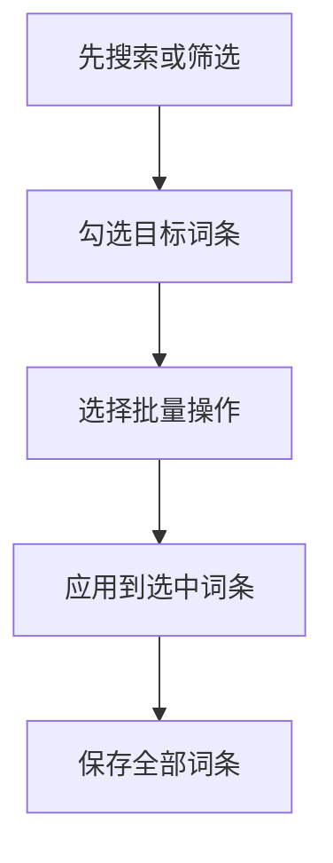

---

## 12.5 批量改插入位置

这是最常用的批量操作之一。

### 适合什么时候用
比如你发现：

- 一整组词条其实都更像世界框架
- 一整组词条都更像角色补丁
- 一整组词条都更像即时提醒

这时候就很适合一口气改到：

- 角色定义前
- 角色定义后
- 聊天内注入

---

## 12.6 批量改聊天深度

这个主要针对：

- 已经在聊天内注入的那一组词条

### 适合什么时候用
比如你发现：

- 这批词条现在都太近了
- 或都太远了

你就可以一次把它们统一调成：
- 深度 0
- 或深度 2

---

## 12.7 批量改注入顺序

这个适合：

- 你已经把条目分好层了
- 但同层里的优先级还想再整理

### 一个直观例子
你把“伦敦相关背景”这组统一排后一点，
把“当前轮即时反应”这组统一排前一点。

这样后面更容易控制同层先后。

---

## 12.8 批量开关递归

这是新增的世界书功能体系里很有价值的一项。

### 什么时候适合统一打开
比如：
- 你有一组明显互相关联的设定链
- 地点会带人物
- 人物会带背景
- 背景会带道具

这时统一开递归参与，会比较方便。

### 什么时候适合统一关闭
比如：
- 这组词条只想被用户直接提到时触发
- 不希望它们被别的词条到处带出来

---

## 12.9 批量启用 / 停用词条

这也是很实用的一项。

### 停用适合什么时候用
比如你想做 A/B 测试：

- 这组词条先全部停掉
- 看看回复有什么变化

### 启用适合什么时候用
比如你已经整理好一整组新词条，
现在想一次全部开启。

---

## 12.10 批量编辑最推荐的使用方式

> [!tip]
> 先搜索，再批量编辑。
>
> 不要一上来对“全部词条”乱批量改。

为什么？

因为搜索能先帮你把目标范围缩小。
这样你更不容易误伤无关词条。

---

## 12.11 一个完整例子：整理“伦敦”相关词条

### 第一步
搜索：

```text
伦敦
```

### 第二步
勾选搜索结果

### 第三步
统一设置：
- 插入位置：角色定义后
- 递归：开启
- 注入顺序：100

### 第四步
保存全部词条

### 这样做的好处也很直接
原本零散的“伦敦相关条目”，
很快就会变成一组结构更整齐的词条。

---

## 12.12 新手使用批量编辑的三个原则

### 原则 1：先筛选，后批量
别对全局乱动手。

### 原则 2：批量改完一定保存
不保存就等于没做。

### 原则 3：批量改完要抽查
至少点开几条确认：
- 位置改对了没有
- 深度改对了没有
- 递归状态改对了没有

---

## 12.13 这一章最后留一句

> [!important]
> 批量编辑不是为了偷懒，
> 而是为了在条目多起来以后，**还能保持结构清楚。**

---

# 到这里，你已经学会了

1. 词条页怎么实际操作
2. 导入和导出真正要注意什么
3. 批量编辑到底适合做什么

---

# 下一步

接下来的第 13～16 章，会继续讲：

- 调试怎么看
- 实战案例
- 常见误区
- 推荐工作流

> [!tip]
> 到这里，说明书就会从“会配置”进入“会排错、会整理、会长期使用”。

---

# 第 13 章：调试怎么看

> [!abstract]
> 本章重点：把调试顺序固定下来——**Hits → Debug → Prompt Preview → 模型回复**。

> [!info]
> 到这一章，基本就不是“会不会填词条”的问题了，而是“出了问题你会不会查”。
>
> 真正常见的情况其实是：
> - 条目写了，但不知道有没有触发
> - 触发了，但不知道进了哪一层
> - 也进去了，但回复看起来还是不对

所以这一章要练的，其实是排查顺序。

---

## 13.1 调试时，先盯住这三样就够了

在当前系统里，你先把这三样看熟，后面排错就会轻松很多：
![[Pasted image 20260423214310.png]]
1. **Worldbook Hits（世界书命中列表）**
2. **Worldbook Debug（世界书调试信息）**
3. **Prompt Preview（提示词预览）**

### 它们分别是干什么的

#### Worldbook Hits（世界书命中列表）
告诉你：

> 这一轮到底命中了哪些 世界书词条

#### Worldbook Debug（世界书调试信息）
告诉你：

> 命中以后，它们是怎么被处理的
> 进了哪层、有没有递归、有没有被截断

#### Prompt Preview（提示词预览）
告诉你：

> 最后真正送进 prompt 的内容长什么样

---

## 13.2 最实用的一句调试口诀

> [!important]
> **先看命中，再看分层，最后看回复。**

不要一上来就盯着模型回答发愣。
正确顺序永远是：

1. 有没命中
2. 命中了谁
3. 进了哪层
4. 最后模型怎么答

---

## 13.3 调试顺序，看这张图最省事

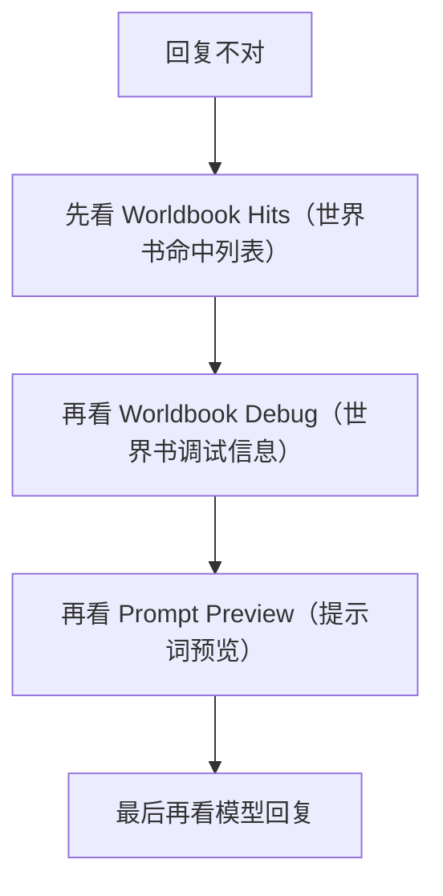

---

## 13.4 什么是 Worldbook Hits（世界书命中列表）
![[Pasted image 20260423214408.png]]
这个最直观，也最好懂。

它回答的问题只有一个：

> **这轮到底命中了哪些词条？**

### 它适合拿来确认什么
- 关键词写得对不对
- 这条世界书到底有没有被匹配到
- 同一轮是不是命中了多条

### 还是拿个例子来说
如果你输入：

```text
我推门走进听雨咖啡。
```

而 Hits 里出现：

- 听雨咖啡

那说明：
- 至少“听雨咖啡”这条 世界书已经被匹配到了

### 如果 Hits 里什么都没有
那先不要去想位置、深度、顺序。
因为第一步就还没命中。

---

## 13.5 Hits 有了，为什么还不够

因为：

> **命中了，不等于最终一定进了 prompt。**

这也是为什么你不能只看 Hits，还得继续看 Debug 和 Prompt Preview（提示词预览）。
![[Pasted image 20260423214436.png]]
### 会发生什么情况
比如：

- 命中了 5 条
- 但 `max_hits = 3`
- 那就会有 2 条虽然命中了，但最后没被保留

这时只看 Hits，你会误以为：
- “都进去了”

但其实没有。

---

## 13.6 什么是 Worldbook Debug（世界书调试信息）
![[Pasted image 20260423214506.png]]
Debug 负责回答更细的问题：

- 这条是在第几层命中的
- 它放到了哪个位置
- 深度是多少
- 顺序是多少
- 是直接命中的，还是递归带出来的
- 最终有没有被真正保留

### 你可以把 Debug 当成什么
它其实更像：

> **世界书这一轮的处理日志**

如果 Hits 是“名单”，
那 Debug 就是“名单背后的过程说明”。

---

## 13.7 Debug 里最值得看的字段

新手先不用一下子看所有东西。
先重点看这几个：

### 1）matched
它命中了什么词

### 2）insertion_position
它最终在哪一层

### 3）injection_depth
如果它是聊天内注入，这条离当前回复有多近

### 4）injection_order
同层里排前还是排后

### 5）matched_depth
它是第几层递归命中的

### 6）matched_from
它是被哪条带出来的

### 7）selected_for_prompt
它最终有没有被保留

### 8）dropped_reason
如果没保留，是因为什么被丢掉

---

## 13.8 什么是 Prompt Preview（提示词预览）

Prompt Preview（提示词预览） 是你最接近“真相”的地方。

因为它看的不是：

- 猜测
- 感觉
- 推断

它真正的意思是：

> **最后真正送给模型的 prompt 分层内容**

### 它最适合确认什么
- 世界书到底进了哪一层
- 角色定义前有没有内容
- 角色定义后有没有内容
- 聊天深度 0/2 有没有内容
- 同层里的顺序对不对

---

## 13.9 调试时的标准顺序

这里给你一个标准操作流程，以后都可以照这个走。

### 第一步：先输入一个明确触发词
比如：

```text
我推门走进听雨咖啡。
```

### 第二步：看 Worldbook Hits（世界书命中列表）
确认“听雨咖啡”有没有命中。

### 第三步：看 Worldbook Debug（世界书调试信息）
确认：
- 它在哪层
- 有没有被保留
- 是否递归带出了别的词条

### 第四步：看 Prompt Preview（提示词预览）
确认它到底出现在：
- 角色定义前
- 角色定义后
- 聊天深度 0 / 2
的哪一块里

### 第五步：最后才看模型回复
确认模型体感是不是和上面一致。

---

## 13.10 一个完整的调试例子

### 你输入
```text
我推门走进听雨咖啡。
```

### 你预期
- 命中“听雨咖啡”
- 如果递归开着，可能带出“雪音”
- 如果再往下递归，可能带出“伦敦念想”

### 你应该怎么查
#### 先看 Hits
如果只看到了“听雨咖啡”，说明递归没继续带出来。

#### 再看 Debug
如果看到：
- matched_depth = 0 的“听雨咖啡”
- matched_depth = 1 的“雪音”
- matched_depth = 2 的“伦敦念想”

那就说明递归工作正常。

#### 再看 Prompt Preview（提示词预览）
看它们最终分别进了：
- 角色前
- 角色后
- 聊天内注入
哪一层。

---

## 13.11 为什么“命中了却没效果”

这是新手最容易崩溃的瞬间。

常见原因有这几种：

### 原因 1：命中了，但被截断了
也就是：
- Hits 有
- 但 `selected_for_prompt = false`

### 原因 2：进的位置和你想的不一样
比如你以为它是即时提醒，
结果你放到了角色定义后。

### 原因 3：深度太远
比如你觉得这轮应该很明显，
但它其实放在比较远的深度。

### 原因 4：顺序排后了
同层里前面还有别的词条，
它没那么靠前。

### 原因 5：模型没明显表现出来
这时候就要回到 Prompt Preview（提示词预览） 看：
- 它到底有没有进去
- 如果已经进了，那就是模型表现层面的问题，不是命中层的问题

---

## 13.12 递归调试怎么看

当你开启递归以后，Debug 会变得特别重要。

### 你最该看什么
#### matched_depth
这条是第几层命中的

#### matched_from
它是从哪条词条带出来的

### 一个典型理解方式
```text
depth = 0 → 用户直接命中
depth = 1 → 第一跳递归
depth = 2 → 第二跳递归
```

### 举例
如果你看到：

- 听雨咖啡：depth 0
- 雪音：depth 1
- 伦敦念想：depth 2

那这条递归链就非常清楚了。

---

## 13.13 新手排错最常见的错误方式

### 错误 1：只看模型回复
不对。

应该先看：
- Hits
- Debug
- Preview

### 错误 2：命中了就以为一定进 prompt
不对。

中间还可能被截断。

### 错误 3：一看到没效果就去乱改关键词
也不对。

先确认：
- 是没命中
- 还是命中了但没保留
- 还是保留了但位置不对

### 错误 4：递归一开就不知道自己在看什么
这时最有用的就是：
- `matched_depth`
- `matched_from`

---

## 13.14 最后把这个顺序记住

> [!important]
> **调试顺序永远是：**
>
> **Hits → Debug → Prompt Preview（提示词预览） → 模型回复**

---

# 第 14 章：实战案例

> [!abstract]
> 本章重点：把前面的概念全部串起来，真正看懂“地点 → 人物 → 背景 → 即时提醒”这套组合思路。

> [!info]
> 前面你已经学了很多概念。
>
> 这一章开始，把它们全部串起来，做成真正能照抄的例子。

---

## 14.1 案例一：地点带人物

### 目标
用户提到“听雨咖啡”时，不只是知道这是个地点，
还能顺势让角色“雪音”也被带出来。

### 配置思路
#### 词条 1：听雨咖啡
- 关键词：听雨咖啡
- 位置：角色定义前
- 用来补地点框架

#### 词条 2：雪音
- 标题 / 关键词里和“听雨咖啡”相关联
- 开启递归参与
- 位置：角色定义后
- 用来补角色说明

### 效果
用户一提地点，
系统不仅知道“店是什么样”，
还可能继续带出“店主是谁”。

---

## 14.2 案例二：人物带背景

### 目标
提到“雪音”时，不只是知道她是谁，
还能带出她和“伦敦”有关的背景。

### 配置思路
#### 词条 1：雪音
- 关键词：雪音
- 开启递归参与

#### 词条 2：伦敦念想
- 关键词：伦敦
- 位置：角色定义后
- 内容：雪音和伦敦之间的长期情绪背景

### 效果
世界书不再是“只补一个点”，
而是形成“人物 → 背景”的链条。

---

## 14.3 案例三：同层顺序控制

### 目标
两条都在“角色定义后”的词条，同时命中时，
让其中一条更靠前。

### 配置思路
#### ORDER_A
- 位置：角色定义后
- 注入顺序：10

#### ORDER_B
- 位置：角色定义后
- 注入顺序：200

### 效果
同层都命中时：
- ORDER_A 先
- ORDER_B 后

### 适合用来做什么
- 当前轮补充里，谁更重要
- 哪条应该先给模型看到

---

## 14.4 案例四：聊天深度做即时提醒

### 目标
让“伦敦”这个话题不只是补背景，
还让角色在当前这一句里有即时反应。

### 配置思路
#### 词条 A：伦敦背景残留
- 位置：聊天内注入
- 深度：2

#### 词条 B：提到伦敦时的即时反应
- 位置：聊天内注入
- 深度：0

### 效果
- 深度 2 负责远一点的背景提醒
- 深度 0 负责这句回复最贴近的即时反应

---

## 14.5 案例五：旧世界书导入后快速整理

### 目标
拿到一个旧包以后，不要手工一条条慢慢改。

### 操作思路
1. 导入旧包
2. 根据导入策略先决定缺失字段补到哪一层
3. 用搜索找出一组相关词条
4. 批量改位置 / 深度 / 递归
5. 保存
6. 去聊天页测试

### 适合什么情况
- 旧 Worldbook 没有新字段
- 你已经知道这批词条大概属于哪种层次
- 你想快速把旧包变成新结构

---

## 14.6 案例六：递归链的安全打开方式

### 目标
不是一上来就开很深，而是稳稳地测试递归。

### 步骤
1. 先只给 2～3 条明显有关联的词条开递归
2. 最大递归层级先设成 1 或 2
3. 先看 Debug
4. 确认链条稳定后，再扩大范围

### 为什么这么分这样做
因为递归最大的风险不是“没效果”，
而是“效果太多，结果你根本看不懂”。

---

## 14.7 这一章其实主要就讲了

> [!tip]
> 真正的 世界书不是一条条孤立的卡片，
> 而是一套：
>
> **地点 → 人物 → 背景 → 即时提醒**
>
> 的组合系统。

---

# 第 15 章：常见误区

> [!abstract]
> 本章重点：世界书最怕的不是少，而是乱。把错误提前看明白，比后面返工更省力。

> [!warning]
> 这一章很重要。
>
> 因为很多时候，世界书不是“不会配”，而是“配法有误区”。

---

## 15.1 误区一：把长期固定人设塞进世界书

比如：

- 雪音一直清冷慢热
- 雪音不轻易袒露心事

这些其实更适合放角色卡。
因为这是角色长期稳定的人设核心。

### 为什么这么分这是误区
因为世界书更适合：
- 关键词触发补充
- 地点背景
- 临时说明

不是用来替代角色卡本体的。

---

## 15.2 误区二：把过去已经发生的事写进角色卡

比如：

- 你昨天已经来过店里
- 你们已经和好了

这些其实更适合放记忆。

### 为什么这么分
因为这不是角色“天生如此”，
而是你们互动后形成的事实。

---

## 15.3 误区三：把本来该放预设的东西全写成常驻

比如：

- 不要抢写用户动作
- 尽量长段落
- 用第二人称
- 减少重复

这些本质上是在管：

> **怎么说**

所以它们更像预设，
不应该因为“每轮都要存在”就直接全部写成 世界书常驻。

### 更稳的判断方式
- 在管输出风格 → 预设
- 在管聊天舞台或叙事基调 → 世界书常驻

---

## 15.4 误区四：把所有 Worldbook 都放同一个位置

前期你可能觉得：
- 都放角色定义后也能跑

但条目一多，这种做法就会越来越乱。

### 问题在哪
- 世界框架和即时提醒混在一起
- 角色补丁和背景规则混在一起
- 排错越来越困难

---

## 15.5 误区五：以为深度越大越强

这是非常常见的误会。

正确理解是：

> **数字越小，越靠近当前回复。**

所以：
- 深度 0 更近
- 深度 2 更远

不是反过来。

---

## 15.6 误区六：以为命中了就一定会生效

不一定。

因为中间还有：
- `max_hits`
- 分层
- 顺序
- 截断

所以你必须看：
- Hits
- Debug
- Prompt Preview（提示词预览）

不能只看“命中了没”。

---

## 15.7 误区七：递归越深越厉害

不一定。

递归深了以后：
- 更容易带出很多词条
- 更容易难调试
- 更容易出现噪音扩散

所以真正好的递归不是“层级高”，
而是“链条稳、可预测”。

---

## 15.8 误区八：一条词条里什么都想写

比如一条里同时写：
- 地点设定
- 人物背景
- 道具说明
- 过去事件
- 当前轮提醒

这样短期看好像很省事，
长期会变成最难维护的一类词条。

### 更稳的做法
把它拆开：
- 地点一条
- 人物一条
- 背景一条
- 即时提醒一条

---

## 15.9 误区九：批量编辑后不抽查

这也很常见。

很多人会：
- 批量改了
- 直接保存
- 然后就以为没问题

更稳的做法是：
- 批量改完以后，点开几条抽查
- 确认位置、深度、递归状态都真的改对了

---

## 15.10 一张图：常见误区集中提醒

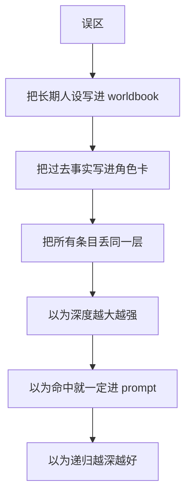

---

## 15.11 本章口诀

> [!important]
> **Worldbook 最怕的不是少，**
>
> **而是乱。**

---

# 第 16 章：推荐工作流

> [!abstract]
> 本章重点：先把基础层跑稳，再一层一层加复杂度，而不是一上来把所有功能全开。

> [!info]
> 这一章是曼波/苏打，算了随你们怎么叫，这章是最终教程。
>
> 目标只有一个：
>
> **让你知道，写卡的顺序到底是什么。**

---

## 16.1 新手最推荐的起步顺序

### 第一步：先定角色卡
先决定：
- 角色是谁
- 性格是什么
- 长期背景是什么

不要一上来就折腾复杂 Worldbook。

### 第二步：再选预设
决定：
- 怎么说
- 输出节奏
- 抢不抢话
- 段落风格

### 第三步：先聊出一些记忆
让关系先动起来。
这样你更容易判断：
- 哪些是已经发生过的事实
- 哪些还只是设定

### 第四步：最后补世界书
这时你会更清楚：
- 哪些东西该按关键词触发
- 哪些东西根本不该塞进 Worldbook

---

## 16.2 世界书的推荐学习顺序

这一段很关键，我建议你后面成稿时保留。

### 第一阶段：基础世界书
先学：
- 标题
- 关键词
- 内容
- 保存
- 测试

### 第二阶段：位置系统
再学：
- 角色定义前
- 角色定义后
- 聊天内注入

### 第三阶段：深度
再学：
- 深度 0
- 深度 2

### 第四阶段：顺序
学：
- 同层先后

### 第五阶段：递归
最后学：
- 递归 V1
- 层级控制
- 终止递归

---

## 16.3 新手最稳的一套 Worldbook 起步配置

如果你完全刚开始，我建议你先用这套：

```text
启用世界书：开
max_hits：3
默认位置：角色定义后
默认深度：0
默认注入顺序：100
递归：关
最大递归层级：2
```

### 为什么这么分这套稳
因为它：
- 容易测
- 不会一下子命中太多
- 不会一上来就把递归搞复杂
- 比较容易理解当前位置系统

---

## 16.4 真正写词条时的最稳流程

### 流程
1. 先写一条基础词条
2. 保存
3. 去聊天页用关键词测试
4. 看 Hits
5. 看 Debug
6. 看 Prompt Preview（提示词预览）
7. 确认没问题后，再继续写下一条

### 为什么这么分不建议一口气写十条
因为一口气写太多以后：
- 你根本不知道哪条起作用
- 一旦不对，很难排查

---

## 16.5 当条目开始变多时，推荐这样整理

### 第一阶段
按主题写
比如：
- 听雨咖啡组
- 雪音组
- 伦敦组

### 第二阶段
按位置分层
比如：
- 框架放角色定义前
- 角色补丁放角色定义后
- 即时提醒放聊天内注入

### 第三阶段
再用批量编辑收拾结构
- 批量改位置
- 批量改深度
- 批量开递归

---

## 16.6 长期使用时最值的习惯

### 习惯 1：每次大改完都导出
这样最安全。

### 习惯 2：每次新写条目都立即测试
不要积到最后一起测。

### 习惯 3：先看 Prompt Preview（提示词预览），再看模型体感
这样排错最快。

### 习惯 4：递归只对明显有关联的条目开
不要全开。

---

## 16.7 一张图：推荐使用路径

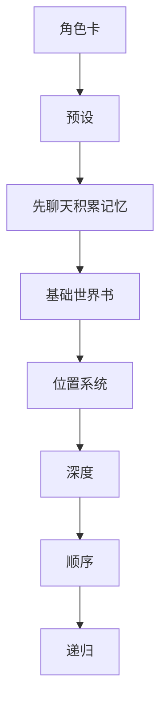

---

## 16.8 最后请记住

> [!important]
> 这套系统真正好不好用，不在于你是不是把所有功能都打开了。
>
> 更关键的是：
>
> **你能不能先把基础层跑稳，再一层一层往上加。**

---

# 附录 A：术语表（简版）

## 预设
决定“怎么说”。

## 角色卡
决定“谁在说”。

## 记忆
记录“以前发生过什么”。

## 世界书
按规则加入的补充设定，既可以是关键词触发，也可以是常驻。

## 关键词触发
提到某个关键词时才加入的 Worldbook。

## 常驻
不依赖关键词、每轮都长期参与的 Worldbook。

## 角色定义前
世界书在角色说明前加入。

## 角色定义后
世界书在角色说明后加入。

## 聊天内注入
世界书更贴近当前聊天轮次加入。

## 深度
聊天内注入离当前回复有多近。

## 注入顺序
同一层里谁排前面。

## 递归
一条词条继续带出下一条词条。

## max_hits
一轮里最终最多允许多少条 Worldbook 进入 prompt。

---

# 附录 B：快速判断表

| 你想到的内容 | 更适合放哪 |
|---|---|
| 不要抢写用户动作 | 预设 |
| 雪音性格清冷慢热 | 角色卡 |
| 你昨天来过店里 | 记忆 |
| 提到伦敦时补背景 | 世界书（关键词触发） |
| 当前故事长期以慢节奏陪伴为主 | 世界书（常驻） |

---

# 附录 C：新手推荐默认值

```text
世界书启用：开
max_hits：3
默认位置：角色定义后
默认深度：0
默认注入顺序：100
递归总开关：关
最大递归层级：2
```

---

## 最后检查清单

在你真正开始长期使用前，建议你最后再确认一遍：

- 我能分清预设、角色卡、记忆、世界书的职责
- 我知道关键词触发和常驻的区别
- 我知道“先分层，再调顺序”
- 我知道“数字越小，聊天深度越近”
- 我知道调试顺序是：Hits → Debug → Prompt Preview → 回复
- 我知道递归不是越深越好
- 我知道导入旧包后，缺字段时会按规则补值
- 我知道条目多了以后，要优先学会搜索和批量编辑

---

# 结语

> [!success]
> 如果你已经完整读到这里，那你应该已经能做到：
>
> - 分清预设、角色卡、记忆、世界书的职责
> - 理解关键词触发与常驻的区别
> - 看懂位置、深度、注入顺序、递归的基本逻辑
> - 独立完成基础配置、导入整理、批量编辑与调试排错

这套系统真正难的地方，不是按钮多，也不是字段多。
真正难的是：

> **把不同类型的信息，放进正确的层里。**

祝你们都能写出你们心仪的卡，愿你们在自己的精神世界里畅游
